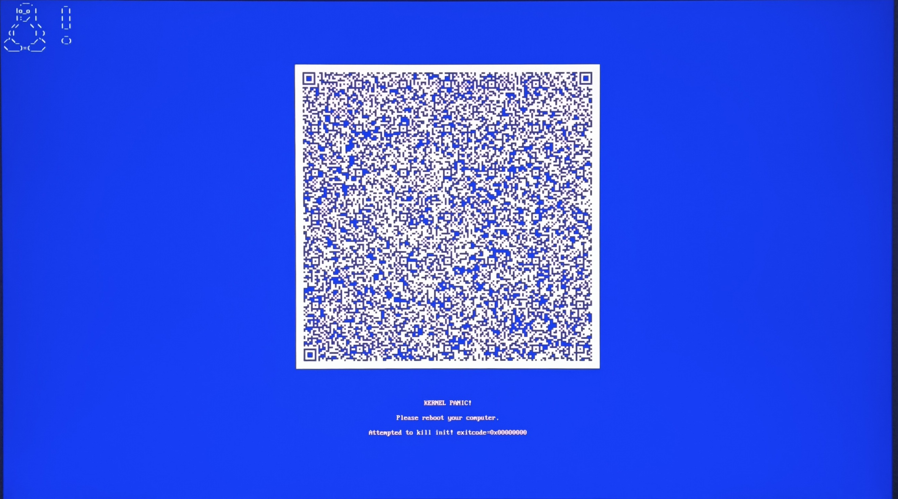

# 开始安装 Arch Linux

插入驱动器，进入 Arch ISO，如有问题可尝试 grub2 模式

## 联网

通常有线连接不需要额外配置，一些网卡（如联发科网卡）会导致 Live 无法启动，请先拔出。

对于无线连接，使用`iwctl`
```shell
rfkill unblock all #防止网卡被禁用
iwctl
device list #枚举设备名
station [device] scan #扫描网络
station [device] get-networks #获取网络列表
station [device] connect [networkname] #连接网络
exit
```


## 处理 Reflecor

> 系统的文件 /etc/pacman.d/mirrorlist 中定义了软件包会从哪个镜像站下载。在 LiveCD 启动的系统上，且在连接到互联网后，reflector 会通过选择 20 个最新同步的 HTTPS 镜像站并按下载速率对其进行排序来更新镜像列表（由于只考虑最新的 20 个镜像站，其结果常不佳）。如果有手动设置镜像站列表的需要，建议停止 reflector.service 服务。

建议禁用 reflector，执行 `systemctl stop reflector`。也可以让 reflector 为您选择镜像，尽管结果通常不佳（贼慢），一个可能的用法是：

```shell
reflector --country China --latest 20 --sort rate --save /etc/pacman.d/mirrorlist

#这会自动按速度选择20个中国镜像，尽管这样的结果还是不怎么样
```

更稳妥的选择是：

```shell
curl -L 'https://archlinux.org/mirrorlist/?country=CN&protocol=https' -o /etc/pacman.d/mirrorlist

#使用 Wiki 提供的大陆镜像
```
!!! warning
    不要添加 archlinuxcn 仓库，这违背 KISS 原则并会导致一些奇怪的问题！`/etc/pacman.d/miirrorlist` 会被新系统继承

## 分区

### 创建分区
执行
```shell
fdisk -l
```
以便识别安装到计算机上的硬盘，结果中以 rom、loop 或者 airootfs 结尾的设备可以被忽略。结果中以 rpbm、boot0 或者 boot1 结尾的 mmcblk* 设备也可以被忽略。
推荐使用 cfdisk，教程见 [archlinux 简明指南](https://arch.icekylin.online/guide/rookie/basic-install.html#_7-%E5%88%86%E5%8C%BA%E5%92%8C%E6%A0%BC%E5%BC%8F%E5%8C%96-%E4%BD%BF%E7%94%A8-btrfs-%E6%96%87%E4%BB%B6%E7%B3%BB%E7%BB%9F)（稍微偷个懒）

!!! note
    如果看不见您的硬盘，关闭 RAID

!!! danger
    谨慎操作！双系统不要新建 EFI，也不要动 Microsoft Basic Data！数据是无价的，您比我更清楚。

!!! tip
    在一些没有对齐的硬盘上，分区工具可能会给出提示，忽略即可，进行对齐需要格式化整块硬盘并重新创建 GPT 表。

### 格式化分区

格式化 EFI 分区
```shell
mkfs.fat -F32 /dev/sdxn
```
!!! danger
    双系统请勿格式化！

格式化根文件系统
```shell
mkfs.btrfs /dev/sdnx
```

创建 swap
```shell
mkswap /dev/sdnx
```
!!! tip
    如果您不需要 swap，可以跳过这一步。

### 挂载分区并创建子卷

挂载根文件系统
```shell
mount -t btrfs -o compress=zstd /dev/sdxn /mnt
```
创建子卷
```shell
btrfs subvolume create /mnt/@ # 创建 / 目录子卷
btrfs subvolume create /mnt/@home # 创建 /home 目录子卷
btrfs subvolume create /mnt/@snapshots # 创建 /snapshots 目录子卷
```
卸载根文件系统
```shell
umount /mnt
```
挂载根文件系统子卷
```shell
mount -t btrfs -o compress=zstd,subvol=@ /dev/sdxn /mnt
```
挂载 home 子卷
```shell
mkdir /mnt/home
mount -t btrfs -o compress=zstd,subvol=@home /dev/sdxn /mnt/home
```
挂载 snapshots 子卷
```shell
mkdir /mnt/snapshots
mount -t btrfs -o compress=zstd,subvol=@snapshots /dev/sdxn /mnt/snapshots
```
挂载 EFI 分区
```shell
mkdir /mnt/boot
mount /dev/sdxn /mnt/boot
```
## 安装和配置基本系统

首先，安装基本系统和工具，您可以把喜欢的工具添加到安装命令中，比如 `vim` 或 `htop` 。
```shell
#我推荐安装这些
pacstrap -K /mnt base linux linux-firmware nano btrfs-progs
```
生成 fstab 文件
```shell
genfstab -U /mnt > /mnt/etc/fstab
```
!!! success
    如果您喜欢 systemd，也可以使用 systemd 单元挂载而非 fstab 文件
然后，change root 到新系统
```shell
arch-chroot /mnt
```

安装微码
```shell
# Intel CPU
pacman -S intel-ucode
# AMD CPU
pacman -S amd-ucode
```

设置时区
```shell
ln -sf /usr/share/zoneinfo/Asia/Shanghai /etc/localtime
hwclock --systohc
```
!!! tip
    上海是此时区内人口最多的城市，所以是上海而非北京

区域和本地化
编辑 `/etc/locale.gen` 文件，取消注释`zh_CN.UTF-8 UTF-8` 和 `en_US.UTF-8 UTF-8`，然后执行
```shell
locale-gen
```
然后创建 locale.conf 文件
```shell
echo "LANG=en_US.UTF-8" > /etc/locale.conf
```
!!! danger
    如果您不使用 kmscon，就不要将 locale 设置为 zh_CN.UTF-8，否则会导致乱码

设置主机名
```shell
echo "myhostname" > /etc/hostname
``` 

更改密码
```shell
passwd
```

## 安装引导加载程序
安装 systemd-boot
```shell
bootctl install
```
编辑 `/boot/loader/loader.conf` 文件，添加以下内容
```ini
default @save
timeout 5
editor no
console-mode max
```
编辑 `/boot/loader/entries/arch.conf` 文件，添加以下内容
```ini
title   Arch Linux # Arch Linux 的标题
linux   /vmlinuz-linux # Linux 内核，请根据实际情况修改
initrd  /initramfs-linux.img # initramfs 文件，请根据实际情况修改
options root=UUID=<UUID> rootflags=subvol=@ rw # 根文件系统的 UUID，请根据实际情况修改
```

!!! danger
    对于 btrfs 文件系统，`rootflags=subvol=@` 是必须的，因为我们使用了子卷。否则你就会见到 arch linux“设计精美的“Kernel Panic 画面
    如果您使用的是其他文件系统，请根据实际情况修改。
!!! tip
    请将 `<UUID>` 替换为您的根文件系统的 UUID，可以通过 `blkid` 命令获取。

## 结束安装
退出 chroot 环境
```shell
exit
```
卸载所有挂载的分区
```shell
umount -R /mnt
```
重启系统
```shell
reboot
```
!!! success
    恭喜您，Arch Linux 已经安装完成！现在您可以开始配置您的系统了。注意，拔出 Live 驱动器，以免再次进入 Live 环境。